# LLM Alignment

大语言模型（LLM）对齐项目，集成了监督微调（Supervised Fine-Tuning, SFT）、群体相对策略优化（Group Relative Policy Optimization, GRPO）和直接偏好优化（Direct Preference Optimization, DPO）三种方法。

---

## 简介 (Introduction)

本项目系统性地探索并实现了大语言模型的三种核心对齐技术：监督微调 (SFT)、群体相对策略优化 (GRPO) 和直接偏好优化 (DPO)。项目从一个基线模型的零样本评测出发，逐步深入到不同对齐算法的实现、消融研究和性能分析，全面评估和对比了这些方法在特定任务上的有效性。

### 主要内容：

* **1. Zero-Shot Baseline**：在GSM8K数学推理任务上对 `Qwen-2.5-Math-1.5B` 进行了零样本评测。结果揭示了该模型在遵循复杂格式化指令上的严重不足（格式正确率仅2.5%），从而**确立了后续对齐工作的必要性**。

* **2. 监督微调 (SFT) 的系统性研究**：通过在不同规模的GSM8K子集上进行SFT实验，验证了SFT能显著提升模型性能。更重要的是，实验揭示了模型在SFT过程中**普遍存在快速过拟合现象**。

* **3. GRPO算法的深度实现与消融研究**：完整实现了GRPO算法，还通过一系列**消融研究）**，分析了其内部关键组件的作用，包括：
    * **基线（Baseline）** 对比策略梯度方差的影响。
    * **优势函数标准化（Advantage Normalization）** 对收敛稳定性的作用。
    * **Off-Policy更新**与**PPO式裁剪（Clipping）** 机制在提升数据利用率和训练稳定性中的核心价值。

* **4. DPO算法的实现与验证**：在 `Llama-3.1-8B` 模型和 `Anthropic HH-RLHF` 偏好数据集上，实现了直接偏好优化（DPO）。实验验证了DPO作为一种**无需强化学习**的轻量级对齐方法，能够有效引导模型学习人类偏好。

---

### 硬件与实验环境

本项目的所有实验均在以下配置的服务器上运行：

* **CPU**: Intel(R) Xeon(R) w9-3595X (60 核 / 120 线程)
* **GPU**: 2 x NVIDIA RTX PRO 6000 (每张显存 96 GB)
* **CUDA 版本**: 12.9
* **NVIDIA 驱动版本**: 575.57.08


### 环境要求 (Prerequisites)

* **Python** 3.12
* **PyTorch** 2.7.1

### 安装 (Installation)

1.  克隆项目仓库：
    ```bash
    git clone https://github.com/wenjia5767/GRPO.git
    cd GRPO
    ```

2.  安装依赖库：
    ```bash
    pip install -r requirements.txt
    ```

-----

| Track           | Model / Data               | Key Setting                 | Format OK ↑ |      Val Acc ↑ |  Steps to Peak |
| --------------- | -------------------------- | --------------------------- | ----------: | -------------: |  ------------: |
| Zero-shot       | Qwen-2.5-Math-1.5B / GSM8K | r1\_zero prompt             |    **2.5%** |      **0.38%** |              — |
| SFT             | Qwen-2.5-Math-1.5B / GSM8K | n=128 / LR=5e-6             |  **93.40%** |     **25.47%** |             10 |
| SFT             | Qwen-2.5-Math-1.5B / GSM8K | n=256 / LR=5e-6             |  **95.15%** |     **25.78%** |              8 |
| SFT             | Qwen-2.5-Math-1.5B / GSM8K | n=512 / LR=5e-6             |  **95.30%** |     **26.38%** |              8 |
| SFT             | Qwen-2.5-Math-1.5B / GSM8K | n=1024 / LR=5e-6            |   **94.39%**|      **26.38%**|              9 |
| REINFORCE       | Qwen-2.5-Math-1.5B / GSM8K | G=8, epochs\_per\_rollout=1 |   **99.39%**|     **80.81%** |             85 |
| GRPO no baseline| Qwen-2.5-Math-1.5B / GSM8K | G=8, epochs\_per\_rollout=1 |   **99.01%**|     **15.24%** |            128 |
| GRPO length norm| Qwen-2.5-Math-1.5B / GSM8K | G=8, epochs\_per\_rollout=1 |   **99.47%**|     **80.36%** |            100 |
| GRPO no std norm| Qwen-2.5-Math-1.5B / GSM8K | G=8, epochs\_per\_rollout=1 |   **99.62%**|     **81.80%** |             87 |
| GRPO off policy | Qwen-2.5-Math-1.5B / GSM8K | G=8, epochs\_per\_rollout=5 |   **99.84%**|     **81.34%** |             65 |
| GRPO no clip    | Qwen-2.5-Math-1.5B / GSM8K | G=8, epochs\_per\_rollout=5 |   **99.69%**|     **83.16%** |             51 |
| DPO             | Llama-3.1-8B / HH-RLHF     | β=0.1                       |           — | ValAcc **67%** |              — |


## 1. Qwen-2.5-Math-1.5B模型在GSM8K数据集上的Zero-Shot评测

##### 评测 `Qwen-2.5-Math-1.5B` 模型在 **GSM8K** 数据集上的零样本数学推理能力。
-----

### 🎯 方法

  * **模型**: `Qwen-2.5-Math-1.5B`
  * **数据集**: GSM8K (共 1319 个样本用于评估)
  * **任务**: 零样本数学推理 (Zero-shot Mathematical Reasoning)
  * **提示工程 (Prompting)**: 数据集中的每个问题都通过 **`r1_zero` 提示模板**进行格式化。该模板要求模型在 `<think>` 标签内生成其推理过程，并在 `<answer>` 标签内生成最终的数值答案。
  * **推理**: 使用 `vllm` 库进行高效的模型推理生成。
  * **评估**: 使用 `r1_zero_reward_fn` 函数来解析模型生成的文本，并将提取出的答案与标准答案进行比较打分。

-----

### 🚀 运行

1.  **环境配置**: 确保已安装所需的 Python 库，主要包括 `vllm`, `datasets`, 和 `transformers`。
2.  **路径配置**: 在运行脚本前，请根据实际情况，修改模型和本地数据集缓存的硬编码路径。
3.  **执行脚本**: 在终端中运行脚本：
    ```bash
    python alignment/gsm8k_baseline.py
    ```

结果在以下文件中呈现：`gsm8k_eval_results.jsonl` (包含每个样本的详细结果) 和 `gsm8k_eval_summary.json` (包含整体的性能指标)。

-----

### 📊 评测结果

在 GSM8K 测试集的 1319 个样本上，模型的基线性能 (baseline performance) 评测结果如下：

```json
{
  "num_examples": 1319,
  "format_rate": 0.025018953752843062,
  "accuracy": 0.0037907505686125853,
  "avg_reward": 0.0037907505686125853,
  "results_path": "gsm8k_eval_results.jsonl"
}
```

  * 模型遵循 `<think>`/`<answer>` 格式的能力较差，导致**格式正确率 (format rate) 极低，仅约 2.5%**。
  * 最终答案的**准确率 (accuracy) 也非常低，仅约 0.38%**，表明该模型在 GSM8K 数据集的零样本设置下面临巨大挑战。

1.  **指令遵循能力缺失**

      * 评测结果的首要问题是模型无法稳定遵循 `<think>`/`<answer>` 这种严格的 XML 风格的输出格式，导致**格式正确率 (format rate) 仅有约 2.5%**。
      * 这表明，`Qwen-2.5-Math-1.5B` 模型虽然可能具备一定的数学知识，但在零样本（Zero-shot）场景下，其指令遵循 (Instruction Following) 能力不足以应对这种复杂的、结构化的输出要求。模型没有被充分地微调来理解并执行这种特定的格式指令。

2.  **准确率是格式错误的直接后果**

      * **准确率 (accuracy) 极低（约 0.38%）**，但这并非完全代表模型的数学推理能力不行。更准确地说，这是格式错误的**下游效应**。
      * `r1_zero_reward_fn` 评估函数必须先成功解析出 `<answer>` 标签里的内容，然后才能判断答案是否正确。既然只有 2.5% 的输出格式正确，那么理论上的最高准确率也已经被限制在了 2.5%。这揭示了一个关键问题：**模型表达答案的能力，成为了评估其推理能力的严重障碍。**

3.  **对零样本评测方法评价**

      * **结论**: 这次基线评测证明，对于 `1.5B` 参数规模的模型，在这种需要复杂推理和严格格式控制的任务上，简单的零样本提示（Prompting）策略是远远不够的。
      * **下一步**:
          * **监督式微调 (Supervised Fine-Tuning)**: 最根本的提升方法是在一批遵循此格式的问答数据上对模型进行微调，从而直接向模型“教授”这种结构化输出的技能。

-----

## 2. 基于 Qwen2.5-Math-1.5B 模型的 GSM8K 数据集 SFT

在 GSM8K 数学推理数据集上进行监督微调（Supervised Fine-Tuning, SFT）, 主要目标是分析训练数据集规模对模型性能的影响，并观察训练动态，特别是过拟合现象。

核心目标是在不同规模的 GSM8K 训练子集上微调 `Qwen2.5-Math-1.5B` 模型。通过追踪模型在不同训练步数下的验证准确率探究：

1.  模型在不同数据量下的学习速度
2.  训练集规模、训练步数与模型泛化性能之间的关系。
3.  为防止过拟合、达到最佳验证准确率，确定理想的训练停止时机。

## 🔬 实验方法

### 模型与数据集

  * **模型**: `Qwen2.5-Math-1.5B`
  * **数据集**: **GSM8K**
  * **数据格式化**: 每个样本都被格式化为一个特定的提示（Prompt），引导模型在 `<think>` 标签内生成思考过程（Chain-of-Thought），并在 `<answer>` 标签内给出最终的数值答案。

### 训练流程

使用标准的监督微调（SFT）目标进行训练，即最小化在目标回复（response tokens）上的**负对数似然损失**（Negative Log-Likelihood Loss）。每个实验使用不同数量的训练样本：

  * `n = 128`
  * `n = 256`
  * `n = 512`
  * `n = 1024`
  * `n = 7473` (全量数据集)

### 评估方法

  * **评估框架**: 使用 `vLLM` 框架在独立的 GPU 上进行快速高效的文本生成和评估。
  * **评估指标**: 核心指标是**验证准确率**。如果模型生成的 `<answer>` 标签内的数值与标准答案完全匹配，则认为该回答正确。
  * **评估频率**: 在训练过程中，周期性地在测试集上评估模型性能，以绘制学习曲线。

-----

## 📊 实验结果与分析

实验结果通过以下图表进行可视化呈现。

### 单次实验性能曲线

以下图表分别展示了在不同训练集规模下，模型验证准确率随训练步数变化的曲线。

<table style="width: 100%;">
  <tr>
    <td align="center">
      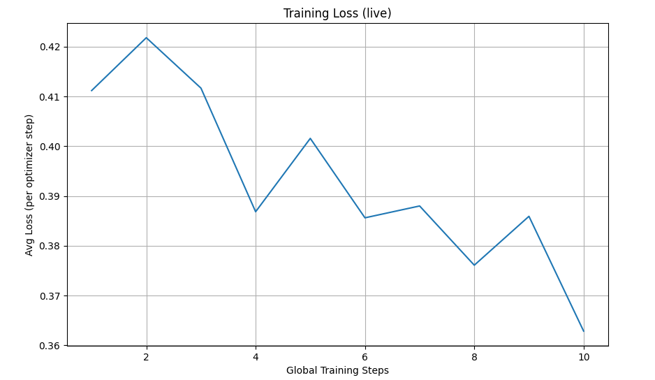
      <br>
      loss n=128
    </td>
    <td align="center">
      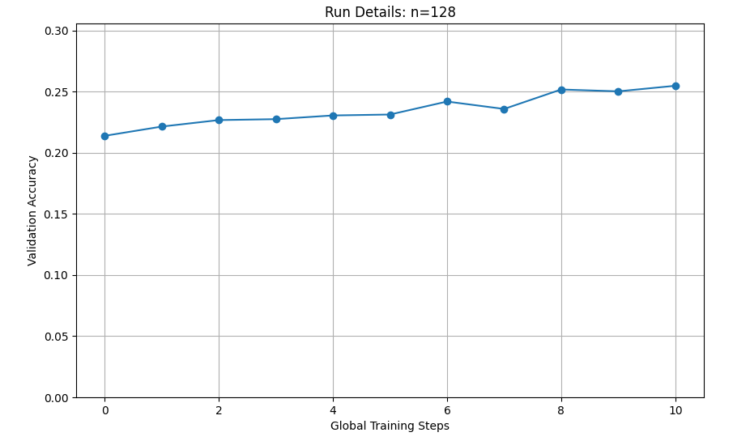
      <br>
      validation accuracy n=128
    </td>
  </tr>
</table>

<table style="width: 100%;">
  <tr>
    <td align="center">
      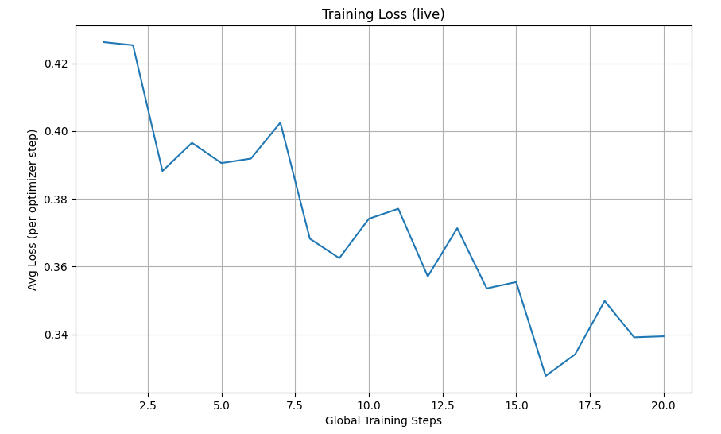
      <br>
      loss n=256
    </td>
    <td align="center">
      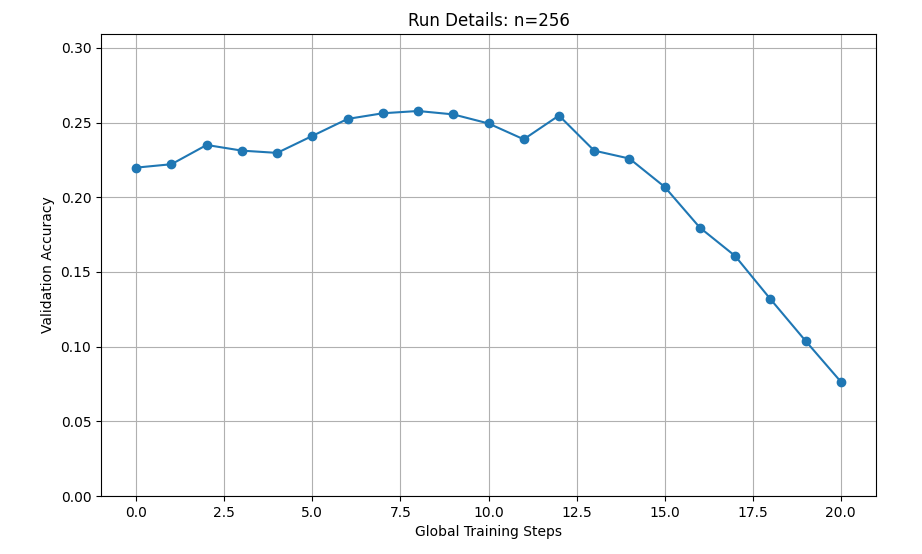
      <br>
      validation accuracy n=256
    </td>
  </tr>
</table>

<table style="width: 100%;">
  <tr>
    <td align="center">
      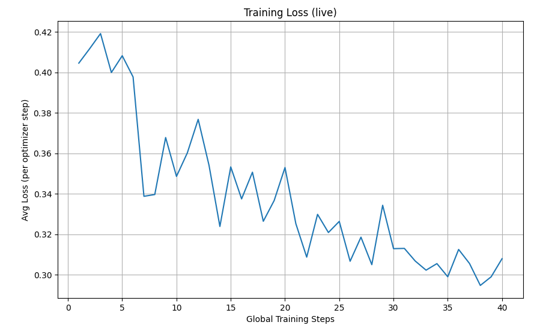
      <br>
      loss n=512
    </td>
    <td align="center">
      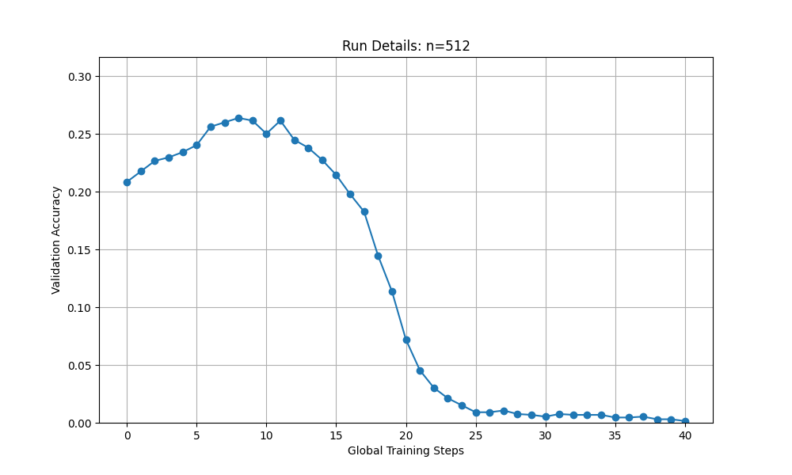
      <br>
      validation accuracy n=512
    </td>
  </tr>
</table>

<table style="width: 100%;">
  <tr>
    <td align="center">
      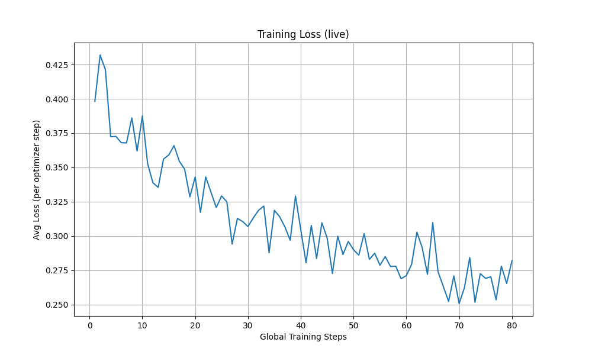
      <br>
      loss n=1024
    </td>
    <td align="center">
      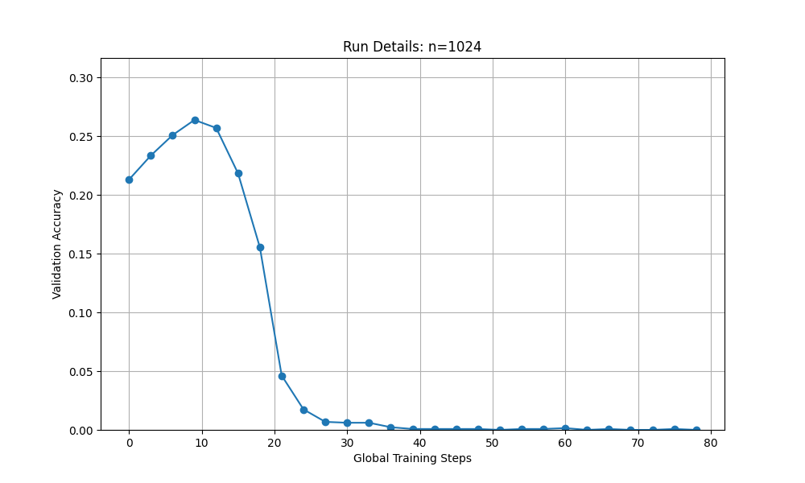
      <br>
      validation accuracy n=1024
    </td>
  </tr>
</table>

<table style="width: 100%;">
  <tr>
    <td align="center">
      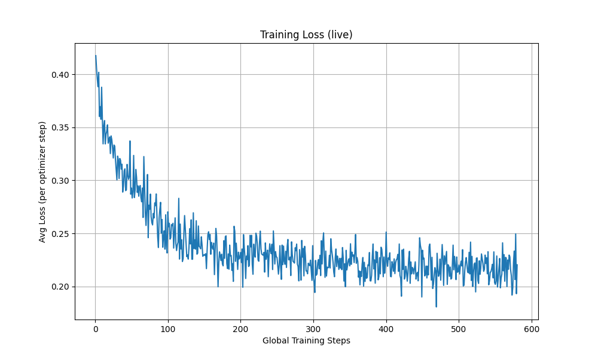
      <br>
      loss n=1024
    </td>
    <td align="center">
      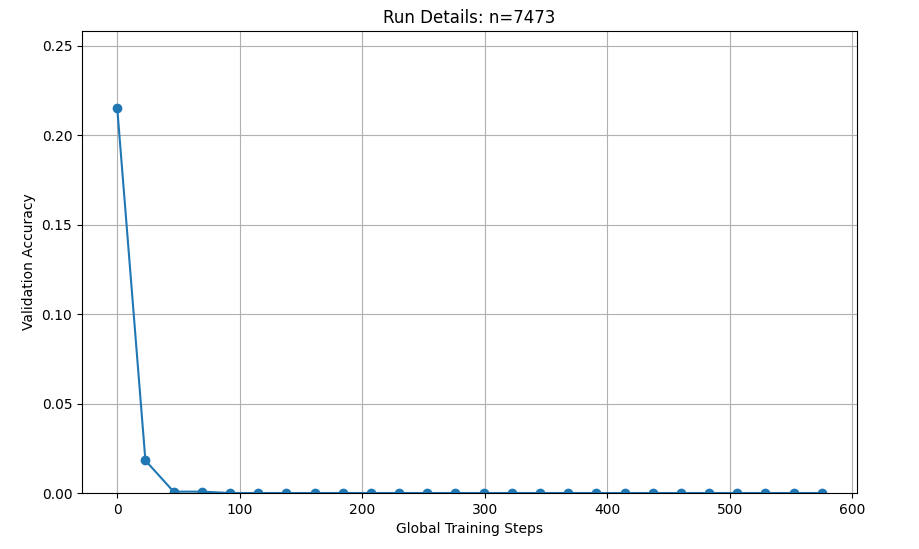
      <br>
      validation accuracy n=1024
    </td>
  </tr>
</table>

### 全局对比图

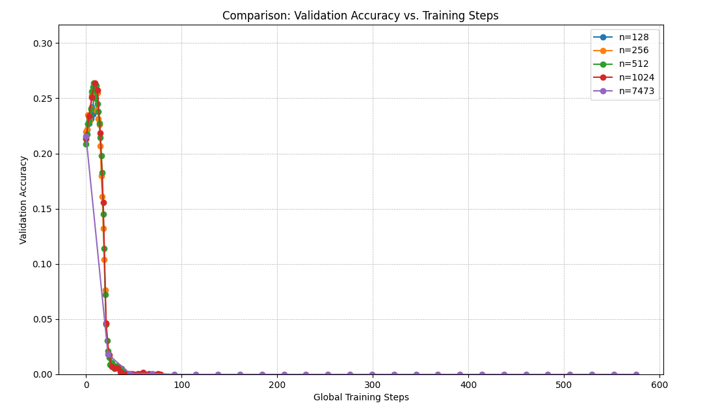

### 核心发现 🧠

1.  **快速过拟合是主要问题**：在几乎所有的实验中（除了 `n=128` 可能因训练步数不足），验证准确率都呈现出明显的“先升后降”模式。准确率先是上升至一个峰值，随后急剧下降。这是典型的**过拟合**（Overfitting）迹象。模型开始“记忆”训练样本，而不是学习通用的解题能力。

2.  **最佳性能出现在训练早期**：模型的最高验证准确率在训练过程的极早期就已达到，通常在前 10-15 个全局训练步（Global Training Steps）内。对于全量数据集（`n=7473`），达到峰值的速度甚至更快。

3.  **早停（Early Stopping）策略至关重要**：这些结果有力地证明了**早停**策略的必要性。在模型达到性能峰值后继续训练，不仅效率低下，而且对其泛化能力有显著的负面影响。表现最好的模型检查点（checkpoint）往往来自训练的早期阶段。

4.  **数据集规模的影响**：虽然更大的数据集能带来稍高的峰值准确率，但它并不能阻止过拟合的发生，仅仅是稍微推迟了性能开始下降的时间点。这表明，对于此任务的 SFT，少量高质量的样本配合极短的训练，可能比在海量数据上进行长时间的训练更为有效。

-----


## 3. GRPO (Group Relative Policy Optimization) 

GRPO 是一种用于强化学习（RL）的策略梯度算法。它的核心思想是通过简化**优势估计**和引入 **PPO 式的裁剪机制**来提高训练的稳定性和效率。

---

### 核心思想 (Core Ideas)

GRPO 解决了传统 RL 算法在 LLM 上遇到的两个主要挑战：

#### 1. Group Normalized Advantage

在传统的 RL 中，通常需要一个独立的价值函数 (value network) 作为基线来估计优势函数，这增加了训练的复杂性。GRPO 巧妙地解决了这个问题：

* **方法**: 对于一个输入问题 $q$，它会使用当前策略 $\pi_{\theta}$ 采样一组 $G$ 个不同的回答 $\{o^{(i)}\}_{i=1}^G$。
* **优势估计**: 优势值 $A^{(i)}$ 不再通过价值网络计算，而是通过对这组回答的奖励 $r^{(i)}$ 进行**Group Normalized Advantage**来得到。

**公式**：

$$A^{(i)} = \frac{r^{(i)} - \text{mean}(r^{(G)})}{\text{std}(r^{(G)}) + \text{eps}}$$

* $A^{(i)}$：第 $i$ 个回答的优势值。
* $r^{(i)}$：第 $i$ 个回答的奖励。
* $\text{mean}(r^{(G)})$ 和 $\text{std}(r^{(G)})$：这组回答的奖励均值和标准差。
* $\text{eps}$：一个很小的常数，用于防止除以零。

#### 2. PPO式裁剪目标 (PPO-style Clipping Objective)

GRPO 采用了与 PPO (Proximal Policy Optimization) 类似的裁剪机制，以限制策略更新的幅度，防止新策略与旧策略偏离太远，从而保证训练的稳定性。

* **方法**: 它使用一个裁剪后的目标函数来优化策略。这个目标函数取重要性采样比率 $\frac{\pi_{\text{new}}}{\pi_{\text{old}}}$ 和一个被裁剪后的重要性采样比率的最小值。

**公式**：
```math
\mathcal{L}(\theta) = \mathbb{E}_{q, \{o^{(i)}\} \sim \pi_{\theta_{\text{old}}}( \cdot | q)} \left[ \min \left( \frac{\pi_{\theta}(o^{(i)}|q)}{\pi_{\theta_{\text{old}}}(o^{(i)}|q)} A^{(i)}, \text{clip} \left( \frac{\pi_{\theta}(o^{(i)}|q)}{\pi_{\theta_{\text{old}}}(o^{(i)}|q)}, 1-\epsilon, 1+\epsilon \right) A^{(i)} \right) \right]
```

* $\pi_{\theta}(new)$：当前策略，即要优化的新策略。
* $\pi_{\theta_{\text{old}}}(old)$：生成回答（rollouts）的旧策略。
* $A^{(i)}$：第 $i$ 个回答的组归一化优势值。
* $\epsilon$：一个小的裁剪范围，通常设置为 0.1 或 0.2。

---

### 训练流程 (Training Workflow)

典型的 GRPO 训练循环如下：

1.  **数据生成 (Rollout)**: 使用**当前策略** $\pi_{\theta_{\text{old}}}$ 采样一批数据和它们的响应。
2.  **优势计算**: 利用这批数据，计算每个响应的奖励并进行组归一化，得到优势值 $A^{(i)}$。
3.  **策略优化**: 使用这些固定的数据，通过最大化 GRPO 目标函数 $\mathcal{L}(\theta)$，对策略 $\pi_{\theta}$ 进行**多次梯度更新**（例如，进行多个 epochs 的训练）。

GRPO 的强大之处在于，它通过巧妙的优势估计和裁剪机制，使得**离策略训练**成为可能，从而极大地提高了训练的数据利用效率。

---

### 使用GRPO算法提高大语言模型在GSM8K数据集上的数学推理能力

### 📊 实验与结果分析

### 🎯 方法

  * **模型**: `Qwen-2.5-Math-1.5B`
  * **数据集**: GSM8K (一个包含 8500 个高质量、语言多样的数学应用题的数据集)
  * **数据生成 (Rollout)**: 使用高效推理引擎 (vLLM) 从 Policy Model 中为每个 prompt 生成多组候选答案。
  * **奖励计算 (Reward Calculation)**: 对每个生成的答案进行评估，并计算其奖励（reward）。
  * **优势计算 (Advantage Calculation)**: 在每组候选答案内部进行奖励归一化（减去均值），计算出优势值 (advantage)。这是 GRPO 算法的核心，它通过组内对比来稳定训练过程。
  * **模型更新 (Policy Update)**: 使用计算出的 advantage ，通过策略梯度方法更新模型参数。

我们进行了一系列对比实验来验证 GRPO 算法不同组件的有效性。

### 实验一：REINFORCE 基线对比 (Baseline vs. No Baseline)
* **目的**: 对比未使用基线的标准策略梯度方法，与使用标准化优势函数（即将奖励减去其均值并除以标准差）的改进方法，以评估后者在降低策略梯度方差、加速模型收敛及提升最终性能方面的有效性。
* **方法**: 分别设置 `loss_type='reinforce_with_baseline'` 和 `loss_type='no_baseline'` 进行了两次独立的训练。

* #### 公式
**No Baseline (简单 REINFORCE)**:
```math
\mathcal{L}(\theta) = - \mathbb{E} \left[ R(o) \cdot \log \pi_{\theta}(o|q) \right]
```

**With Baseline**:
```math
\mathcal{L}(\theta) = - \mathbb{E} \left[\frac{R(o) - \text{mean}(R^{(G)})}{\text{std}(R^{(G)}) + \epsilon} \cdot \log \pi_{\theta}(o|q) \right]
```

* **结果**:
<table style="width: 100%;">
  <tr>
    <td align="center">
      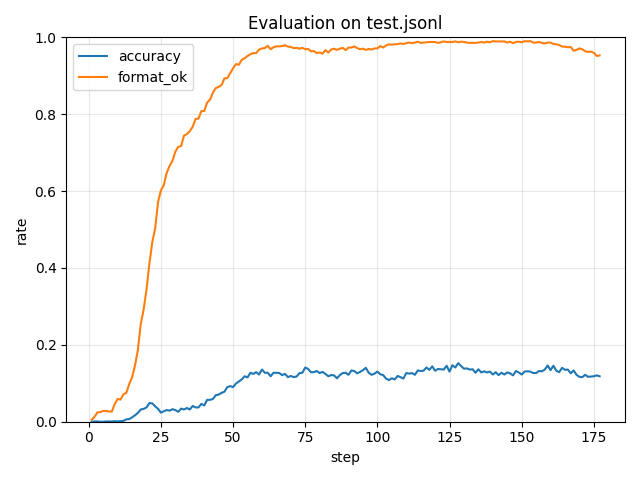
      <br>
      REINFORCE
    </td>
    <td align="center">
      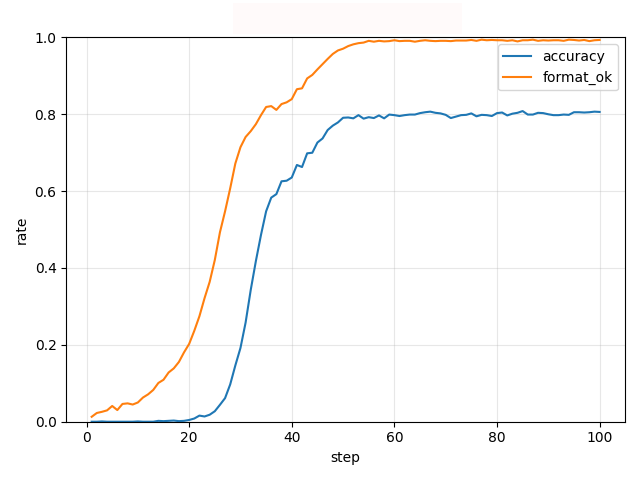
      <br>
      With Baseline
    </td>
  </tr>
</table>

* **分析**: 从训练曲线可以看出，使用基线 (`reinforce_with_baseline`) 的版本收敛更稳定，最终达到的验证集准确率也更高。With Baseline的模式方差更低，收敛更加稳定，且标准化后advantage的尺度基本恒定，避免了无基线时reward方差变化引起的忽大忽小的更新。而相比较下，REINFORCE提高训练步数，格式准确率有明显提高，答案准确率却无法提高，说明模型先学会输出模板，而对解题能力的credit需要更地方差的信号才能持续推进。

### 实验二：长度Normalize方法对比 (`masked_mean` vs. `masked_normalize`)
* **目的**: 比较两种不同的损失长度Normalize方法对最终性能的影响。
* **方法**: 分别设置 `length_normalization_type` 为 `masked_mean` 和 `masked_normalize` 进行了两次 GRPO 训练。

* #### 公式
假设序列总损失为
```math
\mathcal{L}_{\text{seq}} = \sum_{t=1}^{|o|} \mathcal{L}_t
```

**masked_mean**:
```math
  \mathcal{L}_{\text{masked\_mean}} = \frac{1}{|o|} \sum_{t=1}^{|o|} \mathcal{L}_t
```
**masked_normalize**:
```math
  \mathcal{L}_{\text{masked\_normalize}} = \frac{1}{T_{\text{max}}} \sum_{t=1}^{|o|} \mathcal{L}_t
```
其中 $T_{\text{max}}$ 是当前批次中的最大序列长度。

* **结果**:
<table style="width: 100%;">
  <tr>
    <td align="center">
      
      <br>
      Masked Mean
    </td>
    <td align="center">
      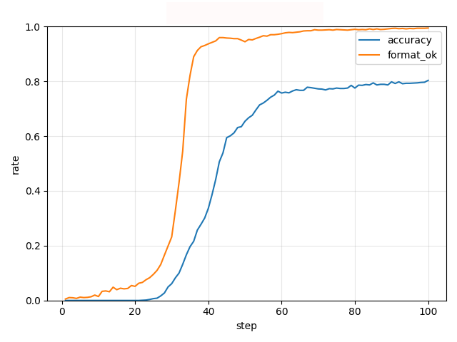
      <br>
      Masked Length Normalize
    </td>
  </tr>
</table>

* **分析**: 两种归一化方法在最终性能上差异不大，但 `masked_mean`（按有效 token 数量归一化）在理论上更精确，因为它不受最大长度 `max_length` 的影响。

### 实验三：Advantage标准化对比 (Std Normalization vs. Mean-Only)
* **目的**: 验证在Group Normalize Advantage时，去掉除以标准差（即Advantage标准化）是否会对结果产生影响。
* **方法**: 分别设置 `use_std_normalization=True` 和 `use_std_normalization=False` 进行了两次 GRPO 训练。

* #### 公式
**Mean-Only Normalization**:
```math
A^{(i)} = r^{(i)} - \text{mean}(r^{(G)})
```
**Standard Deviation Normalization (GRPO 标准方法)**:
```math
A^{(i)} = \frac{r^{(i)} - \text{mean}(r^{(G)})}{\text{std}(r^{(G)}) + \epsilon}
```

* **结果**:
<table style="width: 100%;">
  <tr>
    <td align="center">
      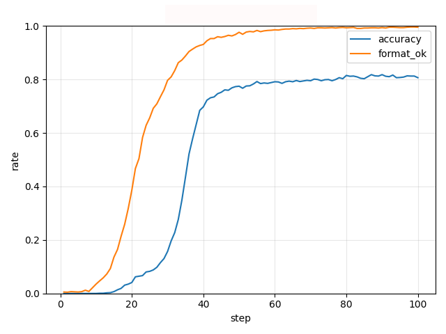
      <br>
      Mean Only Norm
    </td>
    <td align="center">
      
      <br>
      Standard Deviation Norm
    </td>
  </tr>
</table>

* **分析**: 实验结果表明，使用标准差进行归一化 (`True`) 能够进一步稳定优势的范围，使得学习过程对奖励的绝对大小不那么敏感，从而获得了更快的收敛速度，但在该实验上测试集的准确度并没有明显的上升。

### 实验四：Off-Policy GRPO 训练
* **目的**: 实现并验证off-policy GRPO 训练的有效性。
* **方法**: 在一次采样后，进行了 5 个epoch的训练 (`epochs_per_rollout_batch=5`)。在后续epoch，策略 $\pi_{\theta}$ 已经改变，但仍然使用第一个周期开始前计算的旧策略对数概率 `old_log_probs` 来计算Clip损失。

* #### 公式
    off policy 的另一核心是**重要性采样比率** $\rho(\theta)$，并将其应用在Clip目标中。
```math
\rho(\theta) = \frac{\pi_{\theta}(o|q)}{\pi_{\theta_{\text{old}}}(o|q)}
```
```math
\mathcal{L}_{\text{GRPO-Clip}}(\theta) = \mathbb{E} \left[ \min \left( \rho(\theta)A, \text{clip}(\rho(\theta), 1-\epsilon, 1+\epsilon)A \right) \right]
```

* **结果**:
<table style="width: 100%;">
  <tr>
    <td align="center">
      
      <br>
      On Policy No Clip
    </td>
    <td align="center">
      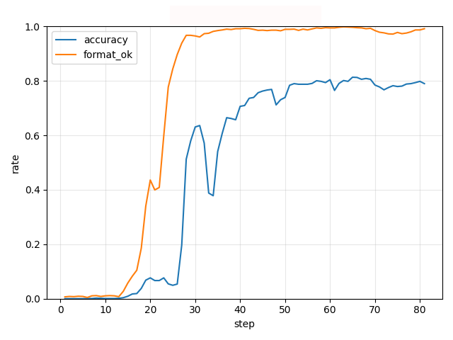
      <br>
      Off Policy with Clip
    </td>
  </tr>
</table>

* **分析**: Off-Policy with Clip 采用重要性采样比并对advantage进行裁剪。允许对同一批轨迹做多轮更新（提高数据利用率），通过裁剪抑制行为策略与当前策略分布偏移带来的高方差/过大更新。
图中 Off-Policy 的早期快速提升符合“同批数据多次利用”的预期。中途振荡对应于策略偏移增大、ρ 触发裁剪的过渡期。随后趋稳说明总体仍保持在可控偏移范围内。

### 实验五：GRPO-Clip 裁剪机制作用分析
* **目的**: 验证 PPO 风格的Clip机制在 GRPO 中的作用。
* **方法**: 实现了一个不带裁剪的损失类型 `"GRPO-No-Clip"`，并将其与标准的 `"grpo_clip"` 损失进行了对比。

* #### 公式
**GRPO-No-Clip (无裁剪)**:
```math
\mathcal{L}_{\text{No-Clip}}(\theta) = - \mathbb{E} \left[ \frac{\pi_{\theta}(o|q)}{\pi_{\theta_{\text{old}}}(o|q)} \cdot A \right]
```
**GRPO-Clip (有裁剪)**:
```math
\mathcal{L}_{\text{GRPO-Clip}}(\theta) = \mathbb{E} \left[ \min \left( \rho(\theta)A, \text{clip}(\rho(\theta), 1-\epsilon, 1+\epsilon)A \right) \right]
```
* **结果**:
<table style="width: 100%;">
  <tr>
    <td align="center">
      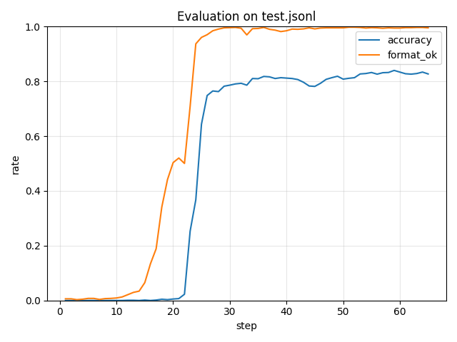
      <br>
      Off Policy No Clip
    </td>
    <td align="center">
      
      <br>
      Off Policy with Clip
    </td>
  </tr>
</table>

<table style="width: 100%;">
  <tr>
    <td align="center">
      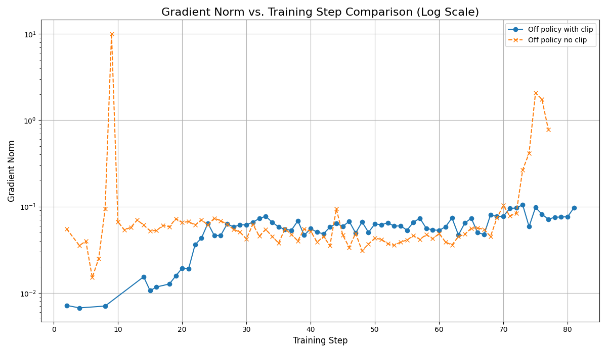
      <br>
      Grad norm comparision
    </td>
  </tr>
</table>

* **分析**: 无裁剪：早期提升正常，但尾段在分布偏移累积后出现整体崩塌。
有裁剪：更早到达高准确率；中期经历一次振荡后维持稳定，最终保持高 format_ok 与较高 accuracy。
多 epoch 复用同一批轨迹时，策略偏移累积，𝜌 分布易出现重尾；无裁剪时更新幅度受个别大 𝜌 主导，导致方差与有效步长在尾段急剧放大，出现同时段 format_ok 与 accuracy 的失效。


-----

## 4.使用Direct Preference Optimization(DPO) 微调 Llama-3.1-8B

使用Direct Preference Optimization (DPO) 来微调 Llama-3.1-8B 模型。其目标是使模型的回答与人类偏好对齐，使其更有用、更无害，同时避免了传统“基于人类反馈的强化学习” (RLHF) 的复杂性。

## 🧐 DPO

直接偏好优化 (DPO) 是一种使语言模型与人类（或AI生成）的偏好对齐的方法。传统的 RLHF 方法需要先训练一个独立的奖励模型，然后使用强化学习（如 PPO）来优化语言模型。与此不同，DPO 提供了一种更直接、更稳定的对齐方案。

DPO 的核心思想是使用一个偏好数据集，其中包含针对同一提示 (prompt) 的成对chosen(更受偏好的)和rejected(不受偏好的)。DPO 直接优化语言模型（**策略模型**），使其最大化生成chosen回答的概率，同时最小化生成rejected回答的概率。

该优化过程由以下loss function指导：
```math
\mathcal{L}_{\text{DPO}}(\pi_\theta; \pi_{\text{ref}}) = -\log\sigma\left(\beta \log \frac{\pi_\theta(y_w|x)}{\pi_{\text{ref}}(y_w|x)} - \beta \log \frac{\pi_\theta(y_l|x)}{\pi_{\text{ref}}(y_l|x)}\right)
```

其中：

  * $\\pi\_\\theta$ 是我们正在训练的 **策略模型 (policy model)**。
  * $\\pi\_{\\text{ref}}$ 是一个固定的 **参考模型 (reference model)**（即微调前原始模型的副本）。
  * $x$ 是输入的提示 (prompt)。
  * $y\_w$ 是“获胜”或被选中的回答。
  * $y\_l$ 是“落败”或被拒绝的回答。
  * $\\beta$ 是一个超参数，用于控制模型偏离参考模型的惩罚强度。
  * $\\sigma$ 是 Sigmoid 函数。

简单来说，这个损失函数鼓励策略模型 ($\\pi\_\\theta$) 相对于参考模型 ($\\pi\_{\\text{ref}}$) 而言，为chosen回答 ($y\_w$) 分配更高的概率，同时为rejected回答 ($y\_l$) 分配更低的概率。

-----

### 关键组成部分：

  * **模型**: `Llama-3.1-8B`

    1.  **策略模型 (Policy Model)**: 这个模型作为policy被训练，其权重会根据偏好数据进行更新。它被放置在 `cuda:0` 上。
    2.  **参考模型 (Reference Model)**: 这是原始模型的冻结副本，其权重不会被更新 (`requires_grad=False`)。它作为一个稳定的基线，防止策略模型在学习过程中过多地偏离其原始能力。它被放置在 `cuda:1` 上，以节省主 GPU 的显存。

  * **数据集**: 使用了 [Anthropic HH-RLHF](https://huggingface.co/datasets/Anthropic/hh-rlhf) 数据集。数据经过处理，提取出单轮对话，最终形成 `(指令, chosen回答, rejected回答)` 的三元组。

  * **训练过程**:

      * **优化器**: 使用 `torch.optim.RMSprop`，学习率为 $1 \\times 10^{-6}$。
      * **超参数 $\\beta$**: 设置为 `0.1`。
      * **批处理 (Batching)**: 使用梯度累积来模拟 `64` 的批处理大小。代码会计算每个样本的损失，对其进行归一化，并在执行优化器步骤之前累积梯度。
      * **硬件**: 该script专为多 GPU 环境设计，至少需要两块 GPU。

### 验证指标：

为了追踪训练进展，使用了一个简单直观的 **验证准确率 (validation accuracy)**。该指标衡量的是，在验证集中，策略模型能够正确地为“获胜”回答分配比“落败”回答更高的对数概率的样本比例。
```math
\text{准确率} = \frac{\sum_{i=1}^{N} \mathbb{I}(\log P(y_{w_i}|x_i) > \log P(y_{l_i}|x_i))}{N}
其中 $\\mathbb{I}$ 是指示函数。
```

-----

## 📊 结果

策略模型在处理后的 HH-RLHF 数据集上训练了一个 epoch。在训练过程中，每 5 个训练步 (training steps) 检查一次验证准确率。
    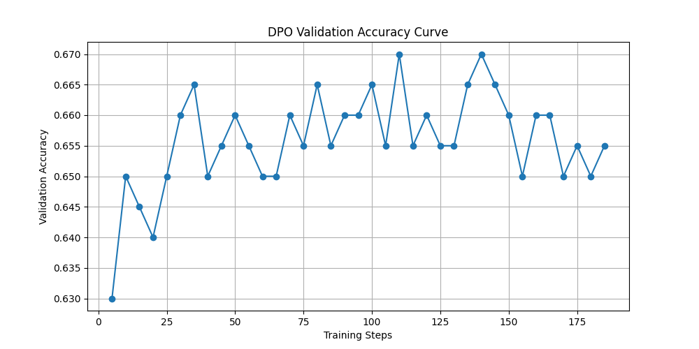

  * 模型展现出清晰的学习趋势，准确率从初始的约 63% 上升至峰值的 **约 67%**。
  * 这一结果表明，DPO 训练能够提高模型如何根据给定的偏好数据更好地区分受欢迎和不受欢迎的回答。
  * 曲线中的波动是正常现象，反映了优化过程的动态性。
