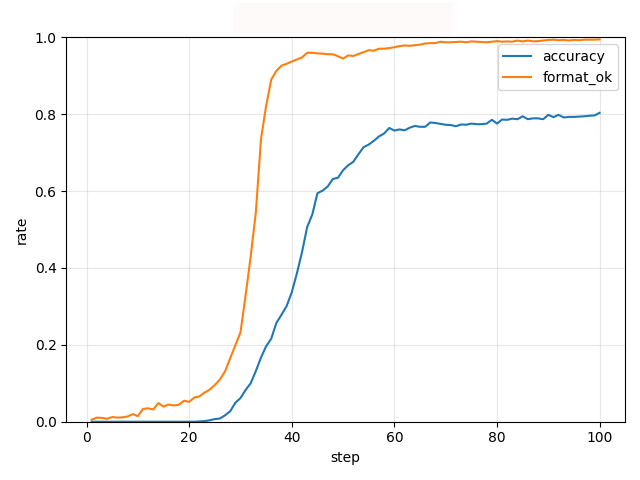

# LLM Alignment

大语言模型（LLM）对齐项目，集成了监督微调（Supervised Fine-Tuning, SFT）、群体相对策略优化（Group Relative Policy Optimization, GRPO）和直接偏好优化（Direct Preference Optimization, DPO）三种方法。

## 简介 (Introduction)

本项目实现了包括SFT、GRPO和DPO在内的多种主流对齐算法，并提供了代码、训练脚本和评估流程。

### 主要内容

* **SFT**：高效的监督微调实现。
* **GRPO**：对Group Relative Policy Optimization算法的完整实现。
* **DPO**：对Direct Preference Optimization算法的完整实现。
* **评估脚本**：提供脚本用于评估模型性能。

### 硬件与实验环境

本项目的所有实验均在以下配置的服务器上运行：

* **CPU**: Intel(R) Xeon(R) w9-3595X (60 核 / 120 线程)
* **GPU**: 2 x NVIDIA RTX PRO 6000 (每张显存 96 GB)
* **CUDA 版本**: 12.9
* **NVIDIA 驱动版本**: 575.57.08


### 环境要求 (Prerequisites)

* **Python** 3.12
* **PyTorch** 2.7.1

### 安装 (Installation)

1.  克隆项目仓库：
    ```bash
    git clone https://github.com/wenjia5767/GRPO.git
    cd GRPO
    ```

2.  安装依赖库：
    ```bash
    pip install -r requirements.txt
    ```

-----

### 1. Qwen-2.5-Math-1.5B模型在GSM8K数据集上的Zero-Shot评测

##### 评测 `Qwen-2.5-Math-1.5B` 模型在 **GSM8K** 数据集上的零样本数学推理能力。
-----

### 🎯 方法

  * **模型**: `Qwen-2.5-Math-1.5B`
  * **数据集**: GSM8K (共 1319 个样本用于评估)
  * **任务**: 零样本数学推理 (Zero-shot Mathematical Reasoning)
  * **提示工程 (Prompting)**: 数据集中的每个问题都通过 **`r1_zero` 提示模板**进行格式化。该模板要求模型在 `<think>` 标签内生成其推理过程，并在 `<answer>` 标签内生成最终的数值答案。
  * **推理**: 使用 `vllm` 库进行高效的模型推理生成。
  * **评估**: 使用 `r1_zero_reward_fn` 函数来解析模型生成的文本，并将提取出的答案与标准答案进行比较打分。

-----

### 🚀 运行

1.  **环境配置**: 确保已安装所需的 Python 库，主要包括 `vllm`, `datasets`, 和 `transformers`。
2.  **路径配置**: 在运行脚本前，请根据实际情况，修改模型和本地数据集缓存的硬编码路径。
3.  **执行脚本**: 在终端中运行脚本：
    ```bash
    python alignment/gsm8k_baseline.py
    ```

结果在以下文件中呈现：`gsm8k_eval_results.jsonl` (包含每个样本的详细结果) 和 `gsm8k_eval_summary.json` (包含整体的性能指标)。

-----

### 📊 评测结果

在 GSM8K 测试集的 1319 个样本上，模型的基线性能 (baseline performance) 评测结果如下：

```json
{
  "num_examples": 1319,
  "format_rate": 0.025018953752843062,
  "accuracy": 0.0037907505686125853,
  "avg_reward": 0.0037907505686125853,
  "results_path": "gsm8k_eval_results.jsonl"
}
```

  * 模型遵循 `<think>`/`<answer>` 格式的能力较差，导致**格式正确率 (format rate) 极低，仅约 2.5%**。
  * 最终答案的**准确率 (accuracy) 也非常低，仅约 0.38%**，表明该模型在 GSM8K 数据集的零样本设置下面临巨大挑战。

1.  **指令遵循能力缺失**

      * 评测结果的首要问题是模型无法稳定遵循 `<think>`/`<answer>` 这种严格的 XML 风格的输出格式，导致**格式正确率 (format rate) 仅有约 2.5%**。
      * 这表明，`Qwen-2.5-Math-1.5B` 模型虽然可能具备一定的数学知识，但在零样本（Zero-shot）场景下，其指令遵循 (Instruction Following) 能力不足以应对这种复杂的、结构化的输出要求。模型没有被充分地微调来理解并执行这种特定的格式指令。

2.  **准确率是格式错误的直接后果**

      * **准确率 (accuracy) 极低（约 0.38%）**，但这并非完全代表模型的数学推理能力不行。更准确地说，这是格式错误的**下游效应**。
      * `r1_zero_reward_fn` 评估函数必须先成功解析出 `<answer>` 标签里的内容，然后才能判断答案是否正确。既然只有 2.5% 的输出格式正确，那么理论上的最高准确率也已经被限制在了 2.5%。这揭示了一个关键问题：**模型表达答案的能力，成为了评估其推理能力的严重障碍。**

3.  **对零样本评测方法评价**

      * **结论**: 这次基线评测证明，对于 `1.5B` 参数规模的模型，在这种需要复杂推理和严格格式控制的任务上，简单的零样本提示（Prompting）策略是远远不够的。
      * **下一步**:
          * **监督式微调 (Supervised Fine-Tuning)**: 最根本的提升方法是在一批遵循此格式的问答数据上对模型进行微调，从而直接向模型“教授”这种结构化输出的技能。


### 3. GRPO (Group Relative Policy Optimization) 

GRPO 是一种用于强化学习（RL）的策略梯度算法。它的核心思想是通过简化**优势估计**和引入 **PPO 式的裁剪机制**来提高训练的稳定性和效率。

---

### 核心思想 (Core Ideas)

GRPO 解决了传统 RL 算法在 LLM 上遇到的两个主要挑战：

#### 1. Group Normalized Advantage

在传统的 RL 中，通常需要一个独立的价值函数 (value network) 作为基线来估计优势函数，这增加了训练的复杂性。GRPO 巧妙地解决了这个问题：

* **方法**: 对于一个输入问题 $q$，它会使用当前策略 $\pi_{\theta}$ 采样一组 $G$ 个不同的回答 $\{o^{(i)}\}_{i=1}^G$。
* **优势估计**: 优势值 $A^{(i)}$ 不再通过价值网络计算，而是通过对这组回答的奖励 $r^{(i)}$ 进行**Group Normalized Advantage**来得到。

**公式**：

$$A^{(i)} = \frac{r^{(i)} - \text{mean}(r^{(G)})}{\text{std}(r^{(G)}) + \text{eps}}$$

* $A^{(i)}$：第 $i$ 个回答的优势值。
* $r^{(i)}$：第 $i$ 个回答的奖励。
* $\text{mean}(r^{(G)})$ 和 $\text{std}(r^{(G)})$：这组回答的奖励均值和标准差。
* $\text{eps}$：一个很小的常数，用于防止除以零。

#### 2. PPO式裁剪目标 (PPO-style Clipping Objective)

GRPO 采用了与 PPO (Proximal Policy Optimization) 类似的裁剪机制，以限制策略更新的幅度，防止新策略与旧策略偏离太远，从而保证训练的稳定性。

* **方法**: 它使用一个裁剪后的目标函数来优化策略。这个目标函数取重要性采样比率 $\frac{\pi_{\text{new}}}{\pi_{\text{old}}}$ 和一个被裁剪后的重要性采样比率的最小值。

**公式**：
```math
\mathcal{L}(\theta) = \mathbb{E}_{q, \{o^{(i)}\} \sim \pi_{\theta_{\text{old}}}( \cdot | q)} \left[ \min \left( \frac{\pi_{\theta}(o^{(i)}|q)}{\pi_{\theta_{\text{old}}}(o^{(i)}|q)} A^{(i)}, \text{clip} \left( \frac{\pi_{\theta}(o^{(i)}|q)}{\pi_{\theta_{\text{old}}}(o^{(i)}|q)}, 1-\epsilon, 1+\epsilon \right) A^{(i)} \right) \right]
```

* $\pi_{\theta}(new)$：当前策略，即要优化的新策略。
* $\pi_{\theta_{\text{old}}}(old)$：生成回答（rollouts）的旧策略。
* $A^{(i)}$：第 $i$ 个回答的组归一化优势值。
* $\epsilon$：一个小的裁剪范围，通常设置为 0.1 或 0.2。

---

### 训练流程 (Training Workflow)

典型的 GRPO 训练循环如下：

1.  **数据生成 (Rollout)**: 使用**当前策略** $\pi_{\theta_{\text{old}}}$ 采样一批数据和它们的响应。
2.  **优势计算**: 利用这批数据，计算每个响应的奖励并进行组归一化，得到优势值 $A^{(i)}$。
3.  **策略优化**: 使用这些固定的数据，通过最大化 GRPO 目标函数 $\mathcal{L}(\theta)$，对策略 $\pi_{\theta}$ 进行**多次梯度更新**（例如，进行多个 epochs 的训练）。

GRPO 的强大之处在于，它通过巧妙的优势估计和裁剪机制，使得**离策略训练**成为可能，从而极大地提高了训练的数据利用效率。

---

## 使用GRPO算法提高大语言模型在GSM8K数据集上的数学推理能力

### 📊 实验与结果分析

### 🎯 方法

  * **模型**: `Qwen-2.5-Math-1.5B`
  * **数据集**: GSM8K (一个包含 8500 个高质量、语言多样的数学应用题的数据集)
  * **数据生成 (Rollout)**: 使用高效推理引擎 (vLLM) 从 Policy Model 中为每个 prompt 生成多组候选答案。
  * **奖励计算 (Reward Calculation)**: 对每个生成的答案进行评估，并计算其奖励（reward）。
  * **优势计算 (Advantage Calculation)**: 在每组候选答案内部进行奖励归一化（减去均值），计算出优势值 (advantage)。这是 GRPO 算法的核心，它通过组内对比来稳定训练过程。
  * **模型更新 (Policy Update)**: 使用计算出的 advantage ，通过策略梯度方法更新模型参数。

我们进行了一系列对比实验来验证 GRPO 算法不同组件的有效性。

### 实验一：REINFORCE 基线对比 (Baseline vs. No Baseline)
* **目的**: 对比未使用基线的标准策略梯度方法，与使用标准化优势函数（即将奖励减去其均值并除以标准差）的改进方法，以评估后者在降低策略梯度方差、加速模型收敛及提升最终性能方面的有效性。
* **方法**: 分别设置 `loss_type='reinforce_with_baseline'` 和 `loss_type='no_baseline'` 进行了两次独立的训练。

* #### 公式
**No Baseline (简单 REINFORCE)**:
```math
\mathcal{L}(\theta) = - \mathbb{E} \left[ R(o) \cdot \log \pi_{\theta}(o|q) \right]
```

**With Baseline**:
```math
\mathcal{L}(\theta) = - \mathbb{E} \left[\frac{R(o) - \text{mean}(R^{(G)})}{\text{std}(R^{(G)}) + \epsilon} \cdot \log \pi_{\theta}(o|q) \right]
```

* **结果**:
<table style="width: 100%;">
  <tr>
    <td align="center">
      
      <br>
      REINFORCE
    </td>
    <td align="center">
      
      <br>
      With Baseline
    </td>
  </tr>
</table>

* **分析**: 从训练曲线可以看出，使用基线 (`reinforce_with_baseline`) 的版本收敛更稳定，最终达到的验证集准确率也更高。With Baseline的模式方差更低，收敛更加稳定，且标准化后advantage的尺度基本恒定，避免了无基线时reward方差变化引起的忽大忽小的更新。而相比较下，REINFORCE提高训练步数，格式准确率有明显提高，答案准确率却无法提高，说明模型先学会输出模板，而对解题能力的credit需要更地方差的信号才能持续推进。

### 实验二：长度归一化方法对比 (`masked_mean` vs. `masked_normalize`)
* **目的**: 比较两种不同的损失长度归一化方法对最终性能的影响。
* **方法**: 分别设置 `length_normalization_type` 为 `masked_mean` 和 `masked_normalize` 进行了两次 GRPO 训练。

* #### 公式
假设序列总损失为
```math
\mathcal{L}_{\text{seq}} = \sum_{t=1}^{|o|} \mathcal{L}_t
```

**masked_mean**:
```math
  \mathcal{L}_{\text{masked\_mean}} = \frac{1}{|o|} \sum_{t=1}^{|o|} \mathcal{L}_t
```
**masked_normalize**:
```math
  \mathcal{L}_{\text{masked\_normalize}} = \frac{1}{T_{\text{max}}} \sum_{t=1}^{|o|} \mathcal{L}_t
```
其中 $T_{\text{max}}$ 是当前批次中的最大序列长度。

* **结果**:
<table style="width: 100%;">
  <tr>
    <td align="center">
      
      <br>
      Masked Mean
    </td>
    <td align="center">
      
      <br>
      Masked Length Normalize
    </td>
  </tr>
</table>

* **分析**: 两种归一化方法在最终性能上差异不大，但 `masked_mean`（按有效 token 数量归一化）在理论上更精确，因为它不受最大长度 `max_length` 的影响。

### 实验三：优势标准化对比 (Std Normalization vs. Mean-Only)
* **目的**: 验证在组归一化优势时，除了减去均值，再除以标准差（即优势标准化）是否能带来提升。
* **方法**: 分别设置 `use_std_normalization=True` 和 `use_std_normalization=False` 进行了两次 GRPO 训练。

* #### 公式
**Mean-Only Normalization**:
```math
A^{(i)} = r^{(i)} - \text{mean}(r^{(G)})
```
**Standard Deviation Normalization (GRPO 标准方法)**:
```math
A^{(i)} = \frac{r^{(i)} - \text{mean}(r^{(G)})}{\text{std}(r^{(G)}) + \epsilon}
```

* **结果**:
<table style="width: 100%;">
  <tr>
    <td align="center">
      
      <br>
      Mean Only Norm
    </td>
    <td align="center">
      
      <br>
      Standard Deviation Norm
    </td>
  </tr>
</table>

* **分析**: 实验结果表明，使用标准差进行归一化 (`True`) 能够进一步稳定优势的范围，使得学习过程对奖励的绝对大小不那么敏感，从而获得了更快的收敛速度，但在该实验上测试集的准确度并没有明显的上升。

### 实验四：Off-Policy GRPO 训练
* **目的**: 实现并验证离策略 GRPO 训练的有效性。
* **方法**: 在一次采样后，我们进行了 5 个周期的训练 (`epochs_per_rollout_batch=5`)。在后续周期，策略 $\pi_{\theta}$ 已经改变，但我们仍然使用第一个周期开始前计算的旧策略对数概率 `old_log_probs` 来计算裁剪损失。

* #### 公式
    off policy 的核心是**重要性采样比率** $\rho(\theta)$，并将其应用在裁剪目标中。
```math
\rho(\theta) = \frac{\pi_{\theta}(o|q)}{\pi_{\theta_{\text{old}}}(o|q)}
```
```math
\mathcal{L}_{\text{GRPO-Clip}}(\theta) = \mathbb{E} \left[ \min \left( \rho(\theta)A, \text{clip}(\rho(\theta), 1-\epsilon, 1+\epsilon)A \right) \right]
```

* **结果**:
<table style="width: 100%;">
  <tr>
    <td align="center">
      
      <br>
      On Policy No Clip
    </td>
    <td align="center">
      
      <br>
      Off Policy with Clip
    </td>
  </tr>
</table>

* **分析**: Off-Policy with Clip 采用重要性采样比并对advantage进行裁剪。允许对同一批轨迹做多轮更新（提高数据利用率），通过裁剪抑制行为策略与当前策略分布偏移带来的高方差/过大更新。
图中 Off-Policy 的早期快速提升符合“同批数据多次利用”的预期。中途振荡对应于策略偏移增大、ρ 触发裁剪的过渡期。随后趋稳说明总体仍保持在可控偏移范围内。

### 实验五：GRPO-Clip 裁剪机制作用分析
* **目的**: 验证 PPO 风格的裁剪机制在 GRPO 中的作用。
* **方法**: 我们实现了一个不带裁剪的损失类型 `"GRPO-No-Clip"`，并将其与标准的 `"grpo_clip"` 损失进行了对比。

* #### 公式
**GRPO-No-Clip (无裁剪)**:
```math
\mathcal{L}_{\text{No-Clip}}(\theta) = - \mathbb{E} \left[ \frac{\pi_{\theta}(o|q)}{\pi_{\theta_{\text{old}}}(o|q)} \cdot A \right]
```
**GRPO-Clip (有裁剪)**:
```math
\mathcal{L}_{\text{GRPO-Clip}}(\theta) = \mathbb{E} \left[ \min \left( \rho(\theta)A, \text{clip}(\rho(\theta), 1-\epsilon, 1+\epsilon)A \right) \right]
```
* **结果**:
<table style="width: 100%;">
  <tr>
    <td align="center">
      
      <br>
      Off Policy No Clip
    </td>
    <td align="center">
      
      <br>
      Off Policy with Clip
    </td>
  </tr>
</table>

* **分析**: 对比实验清晰地显示，带有裁剪机制的 GRPO-Clip 训练过程远比未裁剪的版本要稳定。未裁剪的版本在训练中可能会出现剧烈的性能波动，而裁剪有效地将策略更新限制在一个信任域内，保证了学习过程的平稳进行。

## 直接偏好优化 (DPO)
